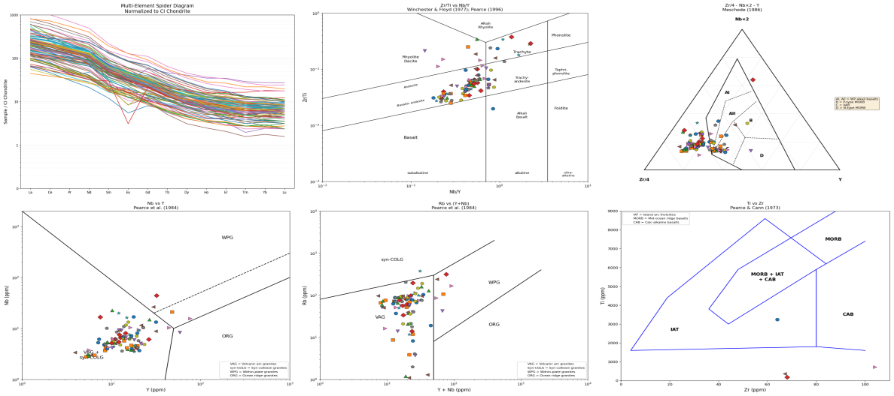

 
# Geochemistry Plotting Tools - QGIS Plugin

A simple geochemistry plotting tool for QGIS that creates spider diagrams, discrimination diagrams, and custom XY plots for geochemical data. Developed for UWA EART3343 Lab exercises

## Features

### Spider Diagrams
- REE only (La-Lu) or extended trace element patterns
- Normalization to CI Chondrite or Primitive Mantle (Sun & McDonough 1989)
- Automatic oxide to element conversion (e.g., TiO2 → Ti)

### Discrimination Diagrams
- Zr/Ti vs Nb/Y (Winchester & Floyd 1977; Pearce 1996)
- Zr/4-Nb×2-Y Ternary (Meschede 1986)
- Nb vs Y (Pearce et al. 1984)
- Rb vs (Y+Nb) (Pearce et al. 1984)
- Ti vs Zr (Pearce & Cann 1973)
- TAS diagrams for plutonic (Wilson 1989) and volcanic (Cox et al. 1979) rocks

### Custom XY Plots
- User-defined element/oxide ratios on both axes
- Mg# calculation (100×Mg/(Mg+Fe) using molar values)
- REE normalization options (Chondrite or Primitive Mantle)
- Linear or logarithmic axis scales

## Installation

### Method 1: Install from ZIP
1. Download `geochem-plots-main.zip` via the green **<> Code** menu button on this page
2. In QGIS, go to **Plugins → Manage and Install Plugins → Install from ZIP**
3. Select the downloaded ZIP file and click **Install Plugin**

## Usage

1. Load a vector point layer with geochemical data
2. Click the **Geochemistry Plotting Tools** button in the toolbar (or menu)
3. A dockable panel will appear on the right side
4. Select your layer and the field to use for sample categories
5. Choose the plot type (Spider, Discrimination, or Custom XY)
6. Select samples to be plotted using one of these methods:
- From the **Samples** list OR 
- From the GIS layer using the **Select Features** tool (click on **Refresh** button if you change layer selections) OR
- Click on the **All** button to select all features in a layer (you can use layer filters to narrow what will be plotted)
7. Click **Generate Plot**
8. Click on the **None** button to clear all selections

## Data Requirements

Your layer should have fields containing geochemical data. The plugin will automatically find fields matching common naming conventions:
- Element names: `La`, `Ce`, `Nb`, `Zr`, etc.
- With suffixes: `La_ppm`, `Zr_PPM`, `Nb (ppm)`, etc.
- Oxides: `SiO2_pct`, `TiO2_wt`, `K2O`, etc.

## Author

Mark Jessell - University of Western Australia    
Claude AI    

## License

This plugin is free software; you can redistribute it and/or modify it under the terms of the GNU General Public License as published by the Free Software Foundation; either version 2 of the License, or (at your option) any later version.

## Example Plots
 
