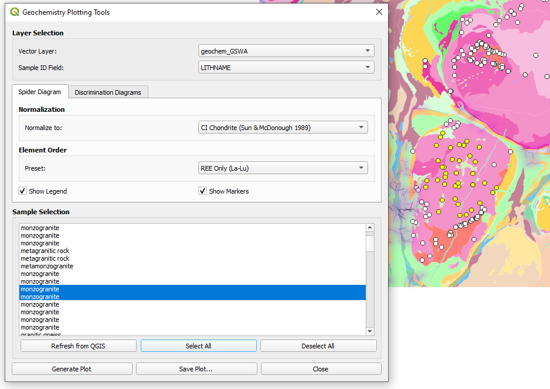

# QGIS Geochemistry Plotting Tools

A Python script for creating geochemical plots directly within QGIS, designed for UWA EART3343 Lab exercises.

## Features

- **Spider Diagrams**: Chondrite or Primitive Mantle normalized multi-element plots (REE + trace elements)
- **Discrimination Diagrams**:
  - Nb/Y vs Zr/Ti (Winchester & Floyd 1977; Pearce 1996)
  - Zr/4-Nb×2-Y ternary (Meschede 1986)
  - Nb vs Y (Pearce et al. 1984)
  - Rb vs (Y+Nb) (Pearce et al. 1984)
  - Ti vs Zr (Pearce & Cann 1973)
  - TAS plots for plutonic (Wilson 1989) and volcanic (Cox et al. 1979) rocks

## Requirements

- QGIS 3.x with Python console
- matplotlib (if it complains you dont have this type into the python colnsole in qgis: `!pip install matplotlib`)
- numpy (if it complains you dont have this type into the python colnsole in qgis: `!pip install numpy`)

## Installation

1. Save `qgis_geochemistry_plots.py` to a convenient location
2. Open QGIS and load your vector point layer containing geochemical data

## Usage

1. Open the QGIS Python Console: **Plugins → Python Console**
2. Click the **Show Editor** button (script icon)
3. Open the script file or paste the code
4. Click **Run Script**
5. A dialog will appear allowing you to:
   - Select your data layer
   - Choose a plotting category field (for legend grouping)
   - Configure spider diagram options (normalization, element order, markers)
   - Select discrimination diagram type
   - Generate and save plots

  

## Data Requirements

Your vector layer should contain attribute fields for geochemical elements. The script automatically matches common field naming conventions:

| Element | Recognized Field Names |
|---------|----------------------|
| Trace elements | `Nb`, `Nb_ppm`, `NB_PPM`, etc. |
| Major oxides | `TiO2_pct`, `K2O_pct`, `SiO2_pct`, `SiO2_wt`, `SiO2_wt_pct` etc. |

**Note**: For spider diagrams, oxide values (K2O, P2O5, TiO2) are automatically converted to element ppm.

## Normalization Values

Spider diagrams use Sun & McDonough (1989) normalization values:
- CI Chondrite
- Primitive Mantle

  

## Tips

- Select specific features in GIS layer before running script to plot only those points, and if update your selection in the map, select the "Refresh from QGIS" button first
- Use the "Plotting Category" field to group samples by rock type, location, etc.
- Category legends appear below plots
- Save plots as PNG, PDF, or SVG using the Save button

## Authors

- Mark Jessell, UWA – January 2026
- Claude AI – January 2026
