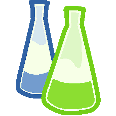
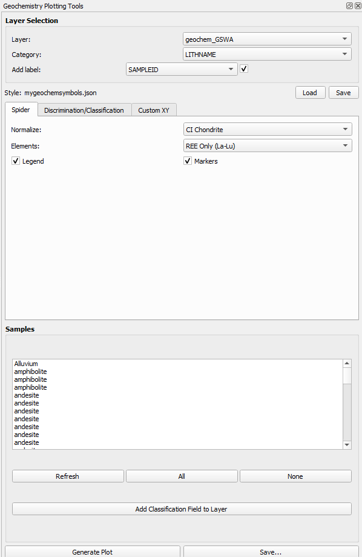
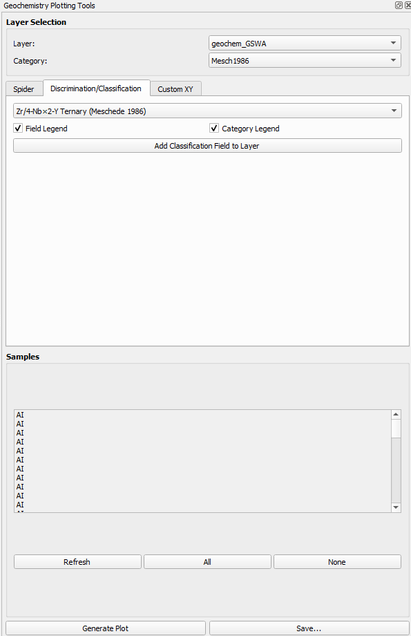
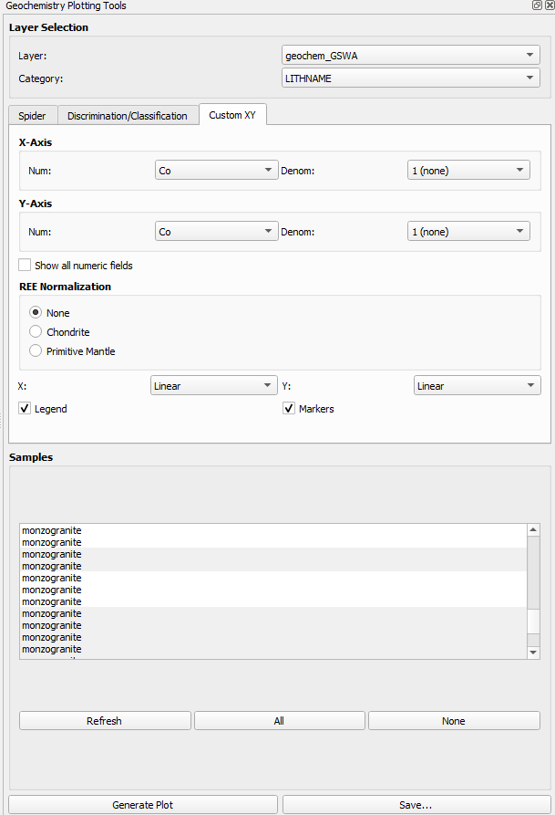
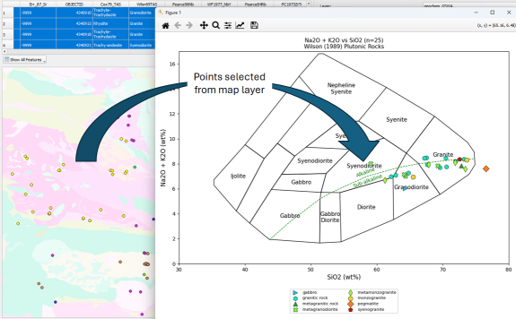
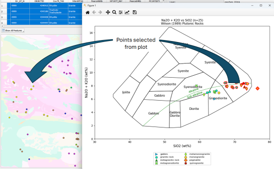
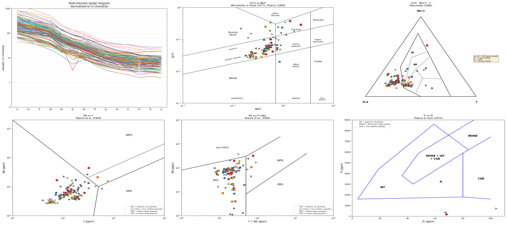

 
# Geochemistry Plotting Tools

_July 2026 - version 0.0.5_

A geochemistry plotting tool for QGIS that creates spider diagrams, tectonic discrimination/classification diagrams, custom XY and ternary plots, mineral classification plots, and petrophysics cross-plots directly from point layer attributes. 
Developed for UWA EART3343 Lab exercises.

# Changelog 0.0.5

      * Add interactive per-category style panel (colour, marker, size, transparency) with save/load/reset/delete templates, replacing the old style JSON file   
      * Add "no category" option to plot all points with a single symbol   
      * Add bubble plots: scale symbol size by a chosen field (linear, log10 or exponential scaling), available for every plot type   
      * Add Filter Layer to Selected / Clear Filter buttons to turn a plot selection into a QGIS layer filter   
      * Fix Ti vs Zr (Pearce & Cann 1973) diagram and add automatic ppm/ppb/wt%/oxide unit conversion across all plots   
      * Recognise many more elements and oxides in Custom XY plots
      * Add Data Preprocessing sub-tab to Custom XY for below-detection-limit (negative value) handling, with substitution options and a review/histogram tool   
      * Add plot-type dropdown to the Minerals tab, ready for future classification schemes   
      * Improve point label readability (white background) and stacking order (always drawn above points)   
      * Various dock panel usability fixes: horizontal scrolling, tabs resize to content, tighter control alignment    

## Installation
### *Installing Dependencies with qpip (Recommended)*
The **GEOL-QMAPS** relies on several Python packages that are not always included in a standard QGIS installation. To simplify dependency management, the plugin supports installation through **qpip**, the QGIS Python package manager.

Before installing **Geochemistry Plotting Tools**, it is recommended to:
1. Install the **qpip** plugin from the QGIS Plugin Manager.
2. Allow **qpip** to install any missing dependencies automatically when prompted by the **Geochemistry Plotting Tools** plugin (or any other plugin with depedencies).

Using **qpip** ensures that all Python dependencies are installed within the active QGIS environment and avoids conflicts with system-wide Python installations.

> **Important:** If the **Geochemistry Plotting Tools** plugin fails to start or reports missing Python modules, first verify that qpip is installed and that all required dependencies have been successfully installed. In most cases, dependency-related issues can be resolved by reinstalling the missing packages through qpip and restarting QGIS.

### *4.2. Geochemistry Plotting Tools QGIS Plugin* 
* The current plugin version and further releases will be made avalaible in the QGIS Plugin Manager Repository.

* Open the QGIS Plugin Manager.

* Switch to the **`All`** tab and search for the plugin name in the search bar.
  
* Select the plugin and click on **Install Plugin**

## Quick Start

1. Load a vector point layer with geochemical data
2. Click the **Geochemistry Plotting Tools** button in the toolbar (or menu) to open the dockable panel

3. Under **Layer Selection**, choose your **Layer**, the **Category** field to colour/group samples by (or `(none)` to plot everything with a single symbol - see [Categories and styling](#categories-and-styling)), and optionally an **Add label** field
4. Pick a plot tab - **Spider, Discrimination/Classification, Custom XY, Custom Ternary, Minerals** or **Petrophysics** (see [Tabs](#tabs) below for what each one offers)

5. Select samples to plot, using any of:
   - The **Samples** list in the plugin (multi-select as usual)
   - The QGIS **Select Features** tool on the map, after selecting the layer in the **QGIS Layers** panel (click **Refresh** in the plugin if the list doesn't update)
   - The **All** button to select every feature (combine with a layer filter or QGIS selection to narrow this down first)

6. Click **Generate Plot**
7. Click **Save...** to export the current plot as PNG, PDF or SVG
8. Click **None** to clear the sample selection

## Tabs

### Spider
- **Normalize** - choose a reference composition to normalise against: 4 chondrite datasets (Sun & McDonough 1989, McDonough & Sun 1995, Boynton 1984, Nakamura 1974), 2 primitive mantle datasets (Sun & McDonough 1989, McDonough & Sun 1995), OIB and N-MORB/E-MORB (Sun & McDonough 1989), 2 depleted mantle datasets (Salters & Stracke 2004, Workman & Hart 2005), and 2 upper continental crust datasets (Rudnick & Gao 2003, Taylor & McLennan 1985)
- **Elements** - REE only (La-Lu), Extended (Ba-Yb, 19 trace elements) or Extended Alt (Cs-Lu, 27 trace elements)
- **Legend** / **Markers** checkboxes
- Y-axis is always log-scaled; oxide fields (e.g. `TiO2`) are automatically converted to their elemental ppm equivalent for normalisation
- [Bubble Size](#bubble-size-all-tabs) section to scale each sample's line markers by an extra field

### Discrimination/Classification
- Plot-type drop-down with 8 diagrams: TAS plutonic (Wilson 1989) and volcanic (Cox et al. 1979), Zr/Ti vs Nb/Y (Pearce 1996; Winchester & Floyd 1977), Zr/4-Nb×2-Y ternary (Meschede 1986), Nb vs Y (Pearce et al. 1984), Rb vs Y+Nb (Pearce et al. 1984), Ti vs Zr (Pearce & Cann 1973)
- **Field Legend** shows the diagram's named fields; **Category Legend** shows sample categories
- [Bubble Size](#bubble-size-all-tabs) section
- **Add Classification Field to Layer** (in the Samples panel) writes the field name each point falls into (or void) back to the layer, for the currently selected diagram

### Custom XY
Split into two sub-tabs:
- **Plot Setup**: X-Axis and Y-Axis, each with a Numerator and an optional Denominator picked from ~70 built-in elements/oxides (or `1 (none)` for no denominator), plus **Show all numeric fields** to pick literal layer field names instead; **REE Normalization** (same reference datasets as Spider); **Linear/Log** scale per axis; **Legend**/**Markers**; [Bubble Size](#bubble-size-all-tabs)
- **Data Preprocessing**: handling for negative, below-detection-limit-coded values - see [Below-detection-limit values](#below-detection-limit-values-custom-xy-only)

### Custom Ternary
- Three apexes (A: top, B: bottom-left, C: bottom-right), each with a Numerator/Denominator pair from the same element/oxide list as Custom XY
- **Show all numeric fields** toggle
- **Legend** / **Markers** checkboxes
- [Bubble Size](#bubble-size-all-tabs) section

### Minerals
- Plot-type drop-down (currently one scheme: Detrital Apatite Classification, Sullivan 2020; more classification schemes can be added here in future)
- **Field Legend** / **Category Legend** checkboxes
- [Bubble Size](#bubble-size-all-tabs) section
- **Add Classification Field to Layer** also works from this tab, for the selected classification scheme

### Petrophysics
- **X-Axis (Density)**: Field picker + units (No Scaling, CGS, or SI [÷1000])
- **Y-Axis (Magnetic Susceptibility)**: Field picker + units (No Scaling, CGS [×4π], SI, or SI ×10⁻³)
- Y-axis is always log-scaled
- **Legend** / **Markers** checkboxes
- [Bubble Size](#bubble-size-all-tabs) section

## Features available on every tab

### Categories and styling

The **Category** field (Layer Selection) groups and colours samples. Choose `(none) - plot all points with one symbol` to skip categorisation and plot every selected sample identically.

Every generated plot opens alongside a **Style** panel docked to the plot window, listing each category with a visibility checkbox and a **Style…** button. The Style… dialog changes a category's symbol shape, size, colour and transparency live. The panel's **Style Management** section lets you Save, Load, Reset or Delete named style templates, stored per QGIS project so they can be re-applied to future plots. If a plot has bubble sizing enabled, symbol size is controlled by the bubble scale instead and can't be overridden per category.

### Bubble Size (all tabs)

Every tab has an optional **Bubble Size** section: pick a numeric field to scale symbol size by, choose a scaling method (**Linear**, **Log10** or **Exponential**), and set the minimum/maximum symbol size. The data range mapped to those sizes is computed automatically from the selected samples (shown in the panel) and a small reference-size legend is drawn on the plot. On the Spider tab, bubble sizing scales each sample's line markers instead of a scatter point.

### Below-detection-limit values (Custom XY only)

Exploration datasets often code values below detection as negative numbers (e.g. `-5` meaning "below detection limit of 5"). By default these plot as literal negative values instead of being silently dropped. The Custom XY tab's **Data Preprocessing** sub-tab can instead substitute them with a positive proxy:
- Half of detection limit
- Detection limit
- Random value (0 to detection limit)
- Fixed value (e.g. `0.001`)

Substitution is computed per-row from each value's own encoded detection limit, so datasets with multiple detection limits per element (e.g. 1-200 ppm depending on analytical method) aren't degraded by a single global substitution. **Review Negative Values in Selected Fields** summarises how many negative values and what detection-limit range exist for the currently chosen X/Y fields, and plots a histogram, to help pick an appropriate substitution before enabling it.

### Interactive point/line selection

**Scatter-based plots** (Discrimination/Classification, Custom XY, Custom Ternary, Minerals, Petrophysics):

| Action | Result |
|---|---|
| Left-click a point | Select that feature in QGIS (replaces current selection) |
| Shift + left-click a point | Add or remove that feature from the QGIS selection |
| Left-click empty space | Clear the QGIS selection |
| Left-click drag (rectangle) | Select all points enclosed by the rectangle |
| Shift + left-click drag | Add all points enclosed by the rectangle to the current selection |

**Spider diagrams:**

| Action | Result |
|---|---|
| Click a sample line | Select that feature in QGIS (replaces current selection) |
| Shift + click a sample line | Add or remove that feature from the QGIS selection |

Selected features are highlighted on the map using QGIS's standard selection colour, and rendered on top of other features in the layer. Hovering near a point/line shows a popup tooltip using the **Add label** field.

> **Note:** Selection is only active when the matplotlib toolbar is in its default state. If zoom or pan is active, click the home/arrow button in the toolbar first to deactivate it.

### Assign labels to points

The **Add label** dropdown and checkbox (Layer Selection) permanently labels selected points/lines in a plot using the chosen field, and also defines the hover popup label. Labels are drawn with a semi-transparent white background and always on top of plotted points, for readability.

### Filter layer to selection

In the **Samples** section, **Filter Layer to Selected** turns whatever is currently selected in QGIS (e.g. after lasso/rectangle-selecting points on a plot) into a real layer filter, so the sample list, plots and attribute table only see those features - handy for saving a selection without editing the source data. **Clear Filter** removes it again.

### Assign classification fields to the layer

For Discrimination/Classification and Minerals plots, **Add Classification Field to Layer** (Samples panel) writes a new/updated text field to the layer, containing the field name each feature falls into for the currently selected diagram (or `void` if outside all defined fields).

## Data Requirements

Your layer should have fields containing geochemical data. The plugin automatically finds fields matching common naming conventions:
- Plain element/oxide names: `La`, `Ce`, `Nb`, `Zr`, `TiO2`, `K2O`, etc.
- With unit suffixes: `La_ppm`, `Zr_PPM`, `Nb (ppm)`, `TiO2_pct`, `K2O_wt`, etc.
- `Symbol_Fullname` style: `Na_Sodium`, `K_Potassium`, `Cl_Chlorine`, etc.
- Units (ppm, ppb, wt%) and elemental/oxide forms are auto-detected per field and converted as needed for each plot (e.g. a layer with only `TiO2_pct` can still drive a Ti-in-ppm plot, and vice versa)
- Negative values coded as below-detection-limit are supported in Custom XY plots - see [Below-detection-limit values](#below-detection-limit-values-custom-xy-only)

## Author

Mark Jessell, Julien Perret - Centre of Exploration Targeting, School of Earth and Oceans, University of Western Australia    
Claude AI    

## License

This plugin is free software; you can redistribute it and/or modify it under the terms of the MIT license.

## Example Plots
 

## Alternatives
- **ioGAS** way more complete commercial system https://www.imdex.com/software/iogas
- **Geoplotters** way more complete Open Source excel templates https://www.geoplotters.com/
- **GeoChemical Data toolkit (GCDkit)** way more complete Open Source R program https://www.gcdkit.org/
- **igrock tools** way more complete online tool https://www.science.smith.edu/~jbrady/petrology/igrocks-tools/igtools-list.php

## Logo
Thanks to https://pixabay.com/vectors/bottles-blue-green-transparent-34333/

## Acknowledgements
Thanks to Quentin Masurel, Leigh Bettenay and Simon Passey for suggestions and beta-testing.
